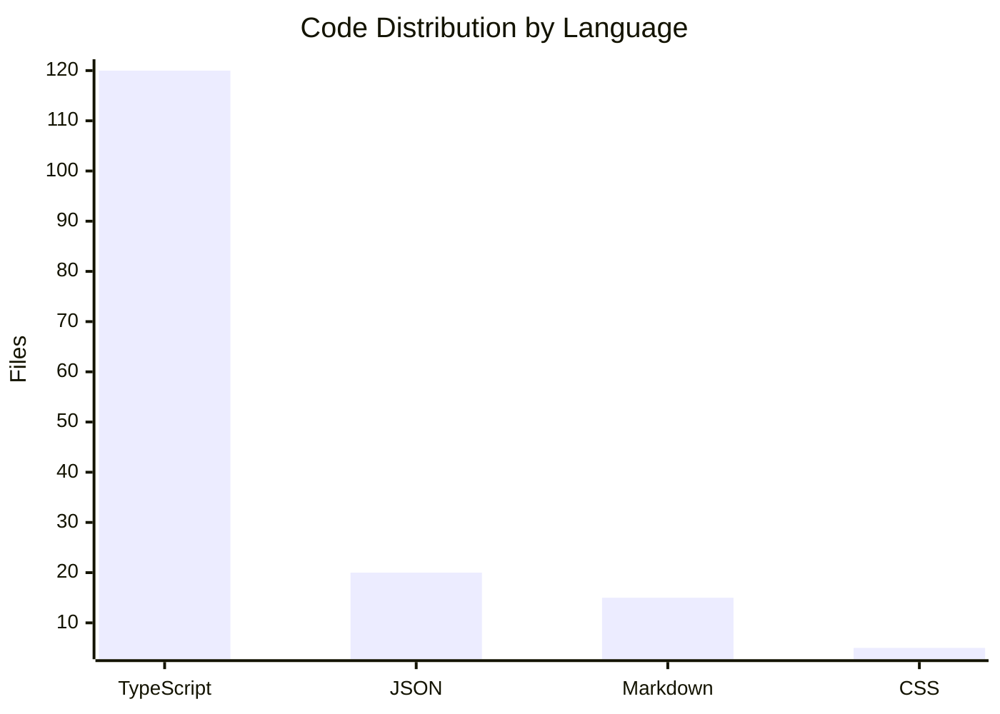

# By the numbers

*Data collected on 2026-04-30*

A quantitative snapshot of the REIT Comparison Dashboard codebase.

## Size

| Metric | Value |
|--------|-------|
| TypeScript source files | ~180 |
| Lines of code (est.) | ~35,000 |
| REIT adapters | 17 |
| JSON reference files | 15 |
| Test files | 15+ |

### Language Breakdown

## Activity

| Period | Commits |
|--------|---------|
| Last 30 days | 44 |
| Peak activity | Apr 2026 |

Most actively changed areas (recent 90 days):

| Directory | Changes |
|-----------|---------|
| `src/adapters/` | New REIT additions (KIP, Paradigm, Sentral, AmFIRST, Tower) |
| `frontend/public/data/` | Generated JSON updates |
| `*.json` | Reference data expansion |

## Citation Coverage

| Metric | Value |
|--------|-------|
| Total references | 970+ |
| Atrium REIT references | 618 |
| Axis REIT references | 352 |
| Display ID prefixes | 16 unique |
| Target direct linkage | >90% |

## Dependencies

### Root (Data Contract)
- `zod` — Schema validation
- `uuid` — UUID generation
- `pdf-parse` — PDF text extraction

### Frontend (Next.js)
- `next` — React framework
- `react` / `react-dom` — UI library
- `recharts` — Charting
- `@tanstack/react-table` — Tables
- `react-markdown` / `remark-gfm` — Markdown rendering
- `tailwindcss` — Styling
- `clsx` — Conditional classes

## Repository Stats

| Stat | Value |
|------|-------|
| REITs tracked | 15 |
| Metrics per REIT | 30+ |
| Sectors covered | 5 (Industrial, Retail, Commercial, Diversified) |
| Countries | Malaysia (primary), Australia, Japan |

## Bot-Attributed Work

Based on commit co-authorship:

| Bot | Activity |
|-----|----------|
| `factory-droid[bot]` | Code generation, refactoring |

Estimated AI-assisted commits: significant portion of recent changes.
