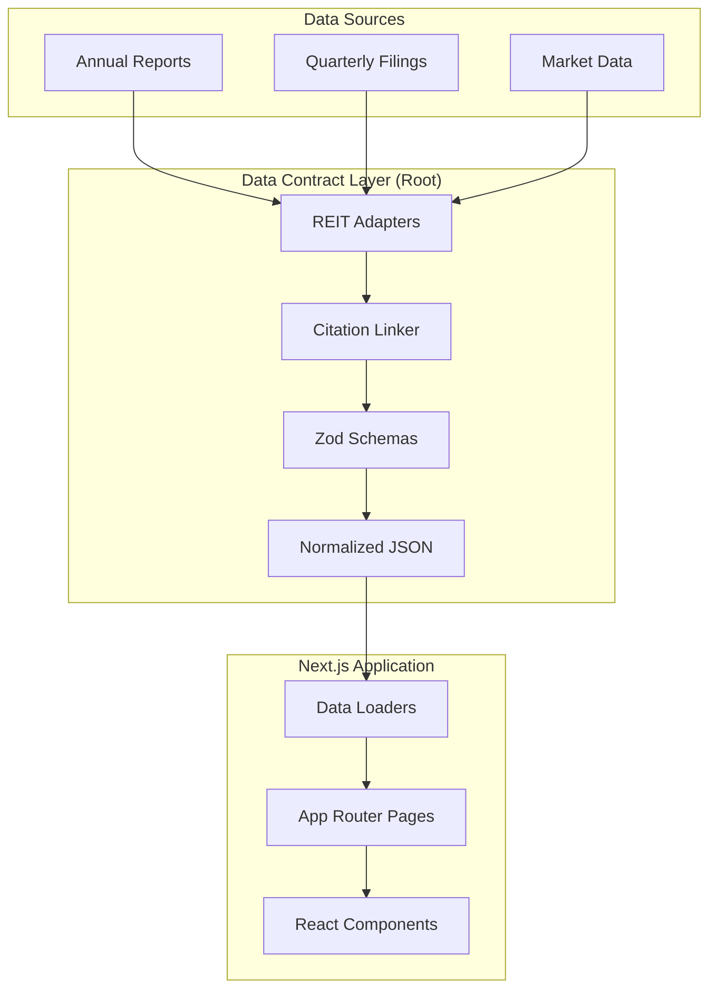
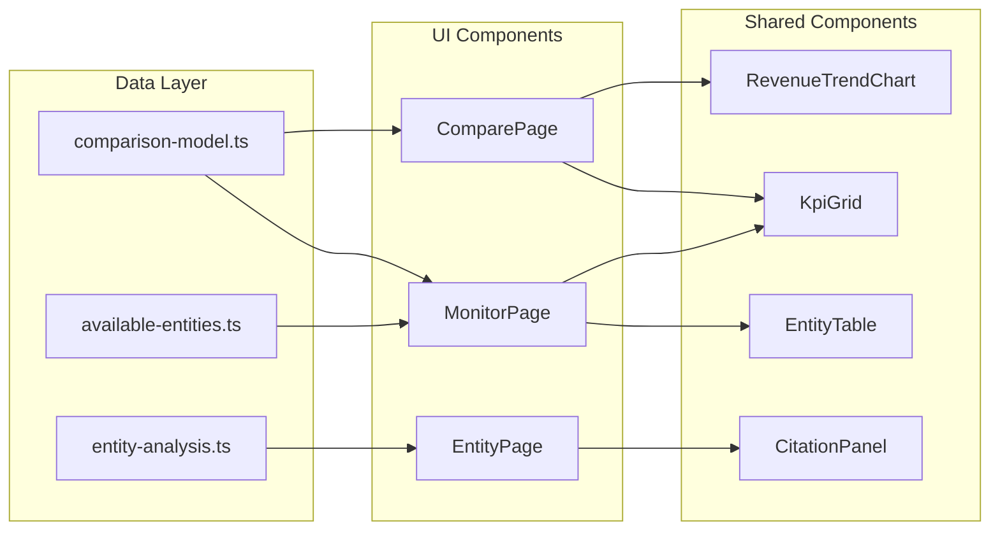
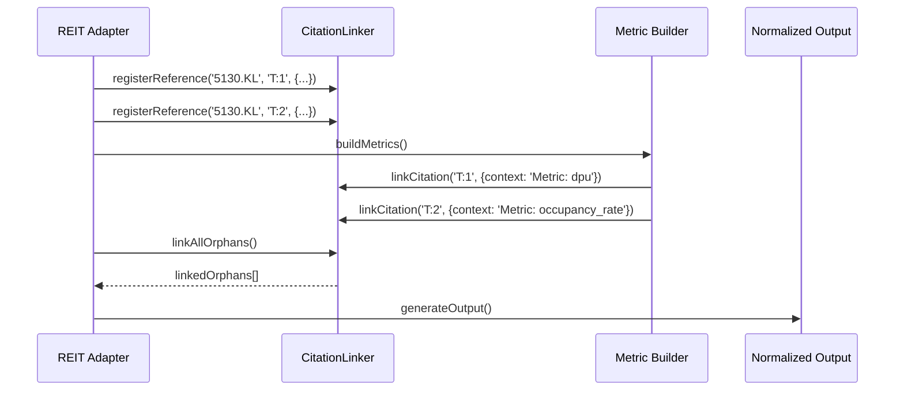

# System architecture

The REIT Comparison Dashboard follows a layered architecture with clear separation between data transformation (backend) and presentation (frontend).

## High-Level Architecture



## Data Flow

1. **Ingestion** — Annual reports and quarterly filings are parsed into reference JSON files (`{slug}-reit-references.json`).

2. **Adapter Processing** — Each REIT has a dedicated adapter (`src/adapters/{slug}-adapter.ts`) that:
   - Registers all display ID references (T:1, A:1, etc.)
   - Builds normalized entities, metrics, time series, observations, and risk assessments
   - Links every fact to its citation via `linkCitation()`

3. **Validation** — Zod schemas enforce type safety at runtime. Schema validation ensures output conforms to `NormalizedReitData`.

4. **Generation** — `scripts/generate-samples.ts` processes all adapters and writes:
   - `test/samples/{slug}-normalized.json` — for contract testing
   - `frontend/public/data/{slug}.json` — for frontend consumption

5. **Frontend Loading** — Dynamic imports in `frontend/lib/comparison-model.ts` load REIT data at runtime.

6. **Rendering** — React components receive normalized data and render tables, charts, and analysis panels.

## Component Relationships



## Citation System Architecture

The citation system is the backbone of data integrity. Every fact is traceable to its source.



Key files:
- `src/adapters/citation-linker.ts` — Core linking logic with UUID generation
- `src/types/reference.ts` — Display ID patterns and reference types
- `src/validation/citation-checker.ts` — Coverage validation

## Directory Responsibilities

| Directory | Purpose |
|-----------|---------|
| `src/adapters/` | Transform source references into normalized format |
| `src/types/` | TypeScript interfaces and Zod schemas |
| `src/validation/` | Schema and citation validation scripts |
| `frontend/app/` | Next.js App Router pages |
| `frontend/components/` | React components (pages + shared) |
| `frontend/lib/` | Data loading, formatting, utilities |
| `frontend/__tests__/` | Jest test suites |
| `frontend/public/data/` | Generated REIT JSON files |

## Build Pipeline

```
make build
├── npm run build          (typecheck root contract)
└── cd frontend && npm run build
    ├── npm run prebuild   (verify citations)
    ├── next build         (static export)
    └── npm run postbuild  (copy public/data to dist/)
```

The build fails if citation verification fails, ensuring no broken links reach production.
