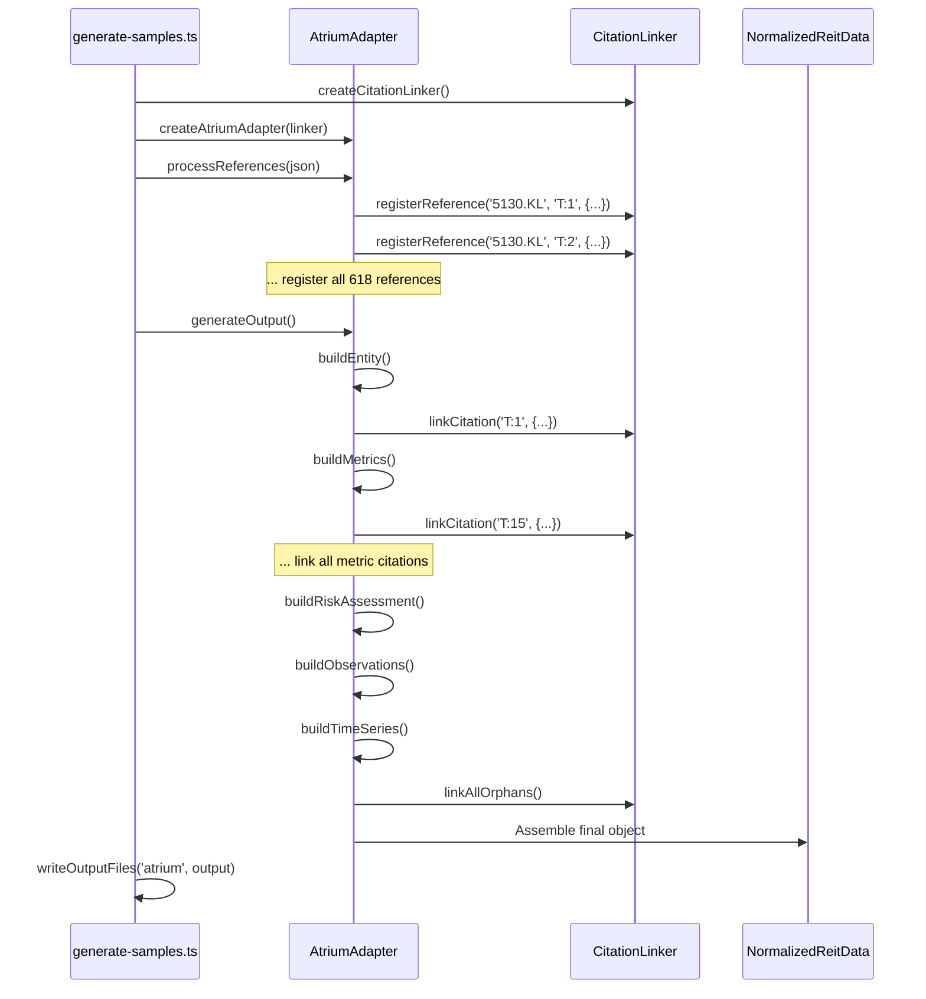

# REIT Adapter System

**Active contributors**: Data pipeline, normalization layer

## Purpose

Adapters transform raw research artifacts (Markdown analysis + JSON references) into normalized schema-compliant data structures. Each Malaysian REIT has a dedicated adapter that handles its specific disclosure patterns, data gaps, and citation prefixes.

## Directory Layout

```
src/adapters/
├── adapter-spec.md              # Specification document
├── citation-linker.ts           # Shared citation linking logic
├── atrium-adapter.ts            # 5130.KL (T:XXX citations)
├── axis-adapter.ts              # 5106.KL (A:XXX citations)
├── sunway-adapter.ts            # 5176.KL (S:XXX citations)
├── pavilion-adapter.ts          # 5212.KL (P:XXX citations)
├── igb-adapter.ts               # 5227.KL (I:XXX citations)
├── uoa-adapter.ts               # 5110.KL (U:XXX citations)
├── cmmt-adapter.ts              # 5180.KL (C:XXX citations)
├── hektar-adapter.ts            # 5121.KL (H:XXX citations)
├── alsalam-adapter.ts           # 5269.KL (L:XXX citations)
├── klcc-adapter.ts              # 5235SS (K:XXX citations)
├── kip-adapter.ts               # 5280.KL (KIP:XXX citations)
├── paradigm-adapter.ts          # 5338.KL (D:XXX citations)
├── sentral-adapter.ts           # 5123.KL (SE:XXX citations)
├── amfirst-adapter.ts           # 5120.KL (AF:XXX citations)
├── tower-adapter.ts             # 5111.KL (To:XXX citations)
└── ytl-adapter.ts               # 5109.KL (Y:XXX citations)
```

## Key Abstractions

| Name | Type | File | Purpose |
|------|------|------|---------|
| `AtriumAdapter` | Class | `src/adapters/atrium-adapter.ts` | Example implementation showing full pattern |
| `CitationLinker` | Class | `src/adapters/citation-linker.ts` | Registers references and links citations |
| `NormalizedReitData` | Interface | `src/types/schema.ts` | Output shape (entity, metrics, timeSeries, riskAssessment, observations) |
| `createXXXAdapter` | Factory | Each `*-adapter.ts` | Creates adapter instance with injected linker |
| `processReferences()` | Method | Each adapter | Parses source JSON and registers display IDs |
| `buildEntity()` | Method | Each adapter | Constructs Entity with citation linkage |
| `buildMetrics()` | Method | Each adapter | Builds 30+ metrics with sourceDisplayIds |
| `buildRiskAssessment()` | Method | Each adapter | Creates RiskAssessment with risk factors |
| `buildObservations()` | Method | Each adapter | Generates structured observations |
| `buildTimeSeries()` | Method | Each adapter | Historical data series with point-level citations |
| `generateOutput()` | Method | Each adapter | Assembles final NormalizedReitData |

## How It Works

### Adapter Lifecycle



### Asymmetric Disclosure Handling

REITs have different disclosure levels. Adapters handle this by omitting metrics entirely when data is unavailable:

| Metric | Atrium | Axis | Handling |
|--------|--------|------|----------|
| `wale_years` | Not disclosed | 4.4 years | Atrium: metric omitted |
| `tenant_count` | Not disclosed | 182 | Atrium: metric omitted |
| `top_tenant_concentration` | ~21% (Lumileds) | 46.7% | Both populated |
| `net_lettable_area` | Not disclosed | ~15m sq ft | Atrium: metric omitted |

### Citation Linking Pattern

Every fact links to its source display IDs:

```typescript
// From atrium-adapter.ts
this.addMetric({
  metricType: 'dpu',
  value: 9.30,
  unit: 'sen',
  period: fy2025,
  sourceDisplayIds: ['T:15', 'T:354', 'T:363', 'T:374']  // ← Citations
});

// The adapter calls linkCitation for each
for (const refId of params.sourceDisplayIds) {
  this.linker.linkCitation(refId, {
    linkType: 'primary',
    linkedBy: 'metric-builder',
    context: `Metric: ${params.metricType}`,
    metricType: params.metricType
  });
}
```

### Orphan Prevention

Adapters ensure 100% citation coverage:

```typescript
// From generateOutput() in atrium-adapter.ts
const linkedOrphans = this.linker.linkAllOrphans('Source reference - Atrium REIT');
if (linkedOrphans.length > 0) {
  console.log(`[AtriumAdapter] Linked ${linkedOrphans.length} orphan references`);
}
```

## Integration Points

| System | Integration | Details |
|--------|-------------|---------|
| [Citation System](./citation-system.md) | Uses `CitationLinker` for all reference operations | Adapters call `registerReference()` and `linkCitation()` |
| [Validation](./validation.md) | Output validated by `SchemaValidator` | `generateOutput()` produces `NormalizedReitData` which `validateData()` checks |
| Data Generation | Called by `scripts/generate-samples.ts` | Each adapter has a `generateXXXSample()` function |
| Frontend | Writes to `frontend/public/data/` | `writeOutputFiles()` creates both test and frontend copies |

## Key Source Files

| File | Lines | Purpose |
|------|-------|---------|
| `src/adapters/atrium-adapter.ts` | ~700 | Canonical adapter implementation |
| `src/adapters/citation-linker.ts` | ~400 | Shared citation linking logic |
| `src/adapters/adapter-spec.md` | ~400 | Specification for mapping rules |
| `scripts/generate-samples.ts` | ~400 | Pipeline orchestration for all 17 REITs |

## Adding a New REIT

Per [AGENTS.md](../../AGENTS.md), the playbook involves:

1. Create `{slug}-reit-references.json` with T:XXX/A:XXX style display IDs
2. Implement `{slug}-adapter.ts` with 6 required methods
3. Wire into `scripts/generate-samples.ts` import + generator function
4. Add to `DisplayIdPattern` in `src/types/reference.ts`
5. Run `make audit-citations` to verify >90% direct linkage
