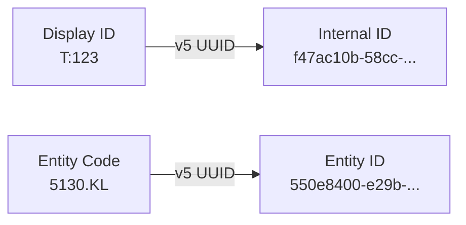
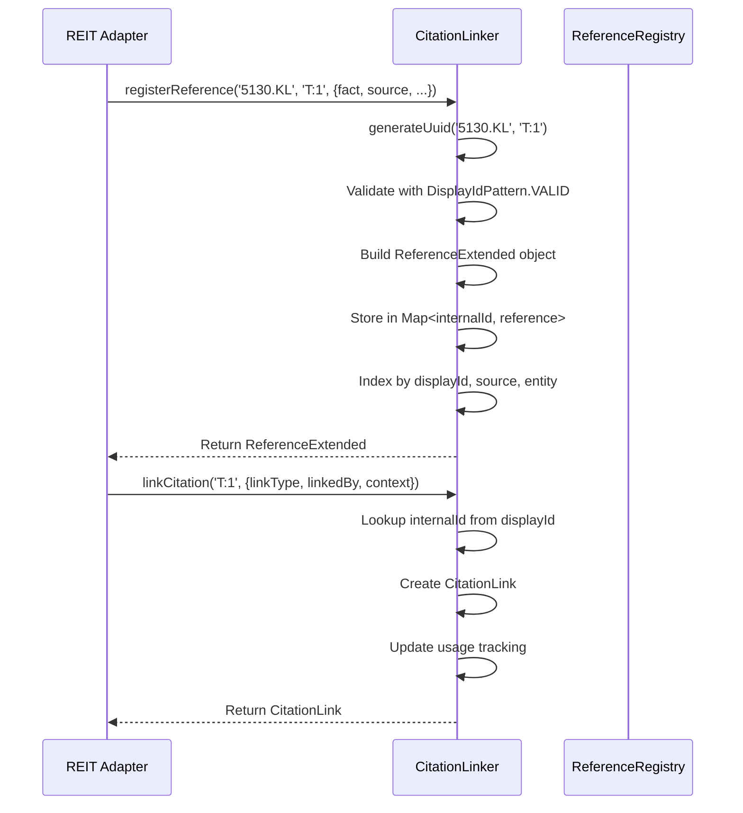

# Citation System

**Active contributors**: Reference integrity, audit trail, data lineage

## Purpose

The citation system ensures every fact in the normalized data traces back to its source. It preserves human-readable display IDs (like `T:123` for Atrium or `A:45` for Axis) while generating stable internal UUIDs for database-like linkage.

## Directory Layout

```
src/
├── adapters/
│   └── citation-linker.ts       # Core linking logic
├── types/
│   └── reference.ts             # Type definitions, display ID patterns
└── validation/
    └── citation-checker.ts      # Coverage verification
```

## Key Abstractions

| Name | Type | File | Purpose |
|------|------|------|---------|
| `CitationLinker` | Class | `src/adapters/citation-linker.ts` | Registers references, creates links, manages UUID mapping |
| `DisplayIdPattern` | Constants | `src/types/reference.ts` | Regex patterns for T:XXX, A:XXX, etc. |
| `ReferenceExtended` | Interface | `src/types/reference.ts` | Full reference with source, quality, usage metadata |
| `CitationLink` | Interface | `src/types/reference.ts` | Single linkage between fact and reference |
| `CitationChecker` | Class | `src/validation/citation-checker.ts` | Validates 100% coverage, reports orphans |
| `CitationCoverage` | Interface | `src/types/reference.ts` | Coverage statistics by category |
| `createCitationLinker()` | Function | `src/adapters/citation-linker.ts` | Factory for new linker instances |
| `generateUuid()` | Static | `CitationLinker` | Creates v5 UUID from entity code + display ID |
| `generateEntityUuid()` | Static | `CitationLinker` | Creates v5 UUID for entity itself |
| `linkAllOrphans()` | Method | `CitationLinker` | Ensures 100% coverage by linking unlinked refs |

## How It Works

### Display ID to UUID Mapping



UUIDs are deterministic (v5) using:
- **Namespace**: `6ba7b810-9dad-11d1-80b4-00c04fd430c8` (DNS namespace)
- **Name format**: `{entityCode}:{displayId}` (e.g., `5130.KL:T:123`)

### Citation Registration Flow



### Display ID Patterns

Each REIT has a unique citation prefix:

| REIT | Prefix | Pattern | Entity Code |
|------|--------|---------|-------------|
| Atrium | T | `^T:\d{1,3}[a-z]?$` | 5130.KL |
| Axis | A | `^A:\d{1,3}[a-z]?$` | 5106.KL |
| Sunway | S | `^S:\d{1,3}[a-z]?$` | 5176.KL |
| Pavilion | P | `^P:\d{1,3}[a-z]?$` | 5212.KL |
| IGB | I | `^I:\d{1,3}[a-z]?$` | 5227.KL |
| UOA | U | `^U:\d{1,3}[a-z]?$` | 5110.KL |
| CMMT | C | `^C:\d{1,3}[a-z]?$` | 5180.KL |
| Hektar | H | `^H:\d{1,3}[a-z]?$` | 5121.KL |
| Al-Salam | L | `^L:\d{1,3}[a-z]?$` | 5269.KL |
| KLCC | K | `^K:\d{1,3}[a-z]?$` | 5235SS |
| KIP | KIP | `^KIP:\d{1,3}[a-z]?$` | 5280.KL |
| Sentral | SE | `^SE:\d{1,3}[a-z]?$` | 5123.KL |
| AmFIRST | AF | `^AF:\d{1,3}[a-z]?$` | 5120.KL |
| Tower | To | `^To:\d{1,3}[a-z]?$` | 5111.KL |
| Paradigm | D | `^D:\d{1,3}[a-z]?$` | 5338.KL |
| YTL | Y | `^Y:\d{1,3}[a-z]?$` | 5109.KL |

Combined validation regex: `^([TAPSUICHLKRDY]:\d{1,3}[a-z]?|KIP:\d{1,3}[a-z]?|SE:\d{1,3}[a-z]?|AF:\d{1,3}[a-z]?|To:\d{1,3}[a-z]?)$`

### Link Types

| Type | Usage |
|------|-------|
| `primary` | Direct citation for a fact |
| `derived` | Calculated from this reference |
| `supporting` | Additional supporting evidence |
| `contrast` | Contrasting view or counterpoint |

### Reference Quality Metadata

```typescript
quality: {
  dateAccessed: string;        // When retrieved
  timeSensitive: boolean;      // Share prices, yields
  isDerived: boolean;          // Calculated values
  confidenceLevel: 'high' | 'medium' | 'low';
  verificationStatus: 'verified' | 'sampled' | 'unverified';
}
```

### Usage Tracking

References track how they're used:

```typescript
usage: {
  metricTypes: string[];       // Which metrics cite this
  observationTypes: string[];  // Which observations cite this
  riskCategories: string[];    // Which risks cite this
}
```

## Integration Points

| System | Integration | Details |
|--------|-------------|---------|
| [Adapters](./adapters.md) | Adapters create and use the linker | Each adapter gets its own `CitationLinker` instance |
| [Validation](./validation.md) | `CitationChecker` validates coverage | Called by `make check-citations` and `make audit-citations` |
| Schema | `sourceDisplayIds` on all facts | Metrics, observations, risk factors all store display IDs |

## Coverage Requirements

The system enforces 100% citation coverage:

- Every metric must have `sourceDisplayIds`
- Every observation must have `sourceDisplayIds`
- Every risk factor must have `sourceDisplayIds`
- All references must be linked to at least one fact

Orphan references (unlinked) are automatically caught:

```typescript
// From citation-checker.ts
if (orphanCount > 0) {
  errors.push(`Found ${orphanCount} orphan references...`);
}

// Overall pass/fail
const passed = orphanCount === 0;
```

## Key Source Files

| File | Lines | Purpose |
|------|-------|---------|
| `src/adapters/citation-linker.ts` | ~400 | Core registration and linking logic |
| `src/types/reference.ts` | ~250 | Display ID patterns, type definitions |
| `src/validation/citation-checker.ts` | ~200 | Coverage verification |

## Helper Functions

```typescript
// Parse display ID into components
parseDisplayId('T:123') → { prefix: 'T', number: 123 }

// Generate new display ID
generateDisplayId('T', 124) → 'T:124'

// Prefix/entity code conversion
entityCodeFromPrefix('T') → '5130.KL'
prefixFromEntityCode('5130.KL') → 'T'

// Validation
isValidDisplayId('T:123') → true
isValidDisplayId('X:999') → false
```
