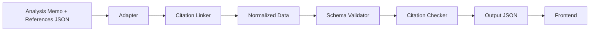

# Systems Overview

The REIT Comparison Dashboard is built on a TypeScript data pipeline that transforms raw research documents into normalized, citation-backed data for the Next.js frontend. This section documents the core systems that make this transformation possible.

## Systems

| System | Purpose | Key Files |
|--------|---------|-----------|
| [Adapters](./adapters.md) | Transform source data into normalized schema | `src/adapters/*-adapter.ts`, `scripts/generate-samples.ts` |
| [Citation System](./citation-system.md) | Link facts to source references with stable IDs | `src/adapters/citation-linker.ts`, `src/types/reference.ts` |
| [Validation](./validation.md) | Schema conformance and citation coverage checks | `src/validation/schema-validator.ts`, `src/validation/citation-checker.ts` |

## Architecture Overview

The system follows a pipeline architecture:

1. **Input**: Research memos (Markdown) + reference JSON files
2. **Processing**: Adapters parse and transform data using the Citation Linker
3. **Validation**: Schema and citation validators ensure data quality
4. **Output**: Normalized JSON consumed by the Next.js frontend

## Directory Structure

```
interesting-assets/
├── src/
│   ├── adapters/           # 16 REIT adapters + citation linker
│   ├── types/              # Schema, reference, observation, risk types
│   └── validation/         # Schema validation + citation checking
├── scripts/
│   └── generate-samples.ts # Data generation pipeline
├── test/samples/           # Test fixtures (*.json)
└── frontend/
    └── public/data/        # Runtime data files
```

## Data Flow



## Key Metrics

- **16 REITs** covered with dedicated adapters
- **4,700+ total references** across generated data packs
- **6 core entity types**: Entity, Metric, TimeSeries, RiskAssessment, Observation, Reference
- **100% citation coverage** required (zero orphans)

## Integration Points

- **Frontend**: Reads from `frontend/public/data/*.json`
- **CI Pipeline**: Runs `make check-citations` and `make verify-citations`
- **Data Generation**: `npx ts-node scripts/generate-samples.ts`
