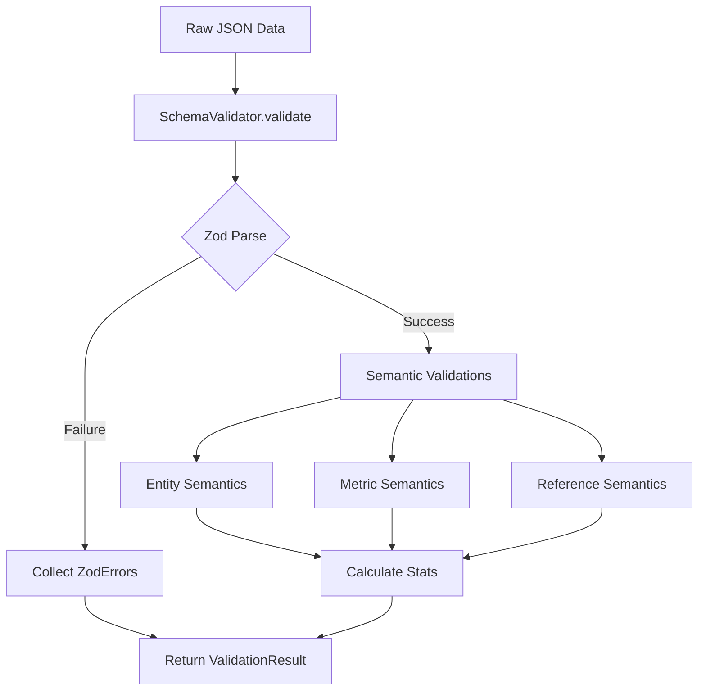
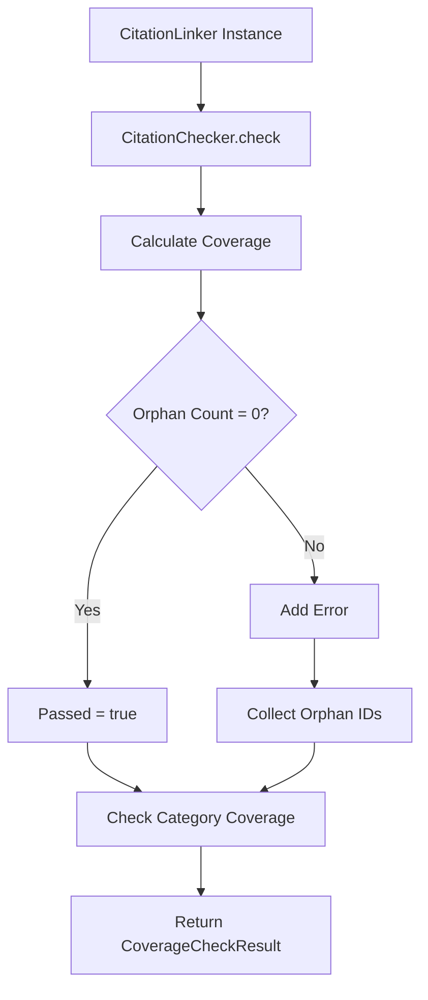

# Validation System

**Active contributors**: Data quality, schema conformance, citation coverage

## Purpose

The validation system ensures all normalized REIT data conforms to the schema and maintains complete citation coverage. It runs during CI and local development via Make targets.

## Directory Layout

```
src/validation/
├── schema-validator.ts      # Zod-based schema validation
├── citation-checker.ts      # Citation coverage verification
└── pdf-extraction-validator.ts  # PDF extraction quality checks
```

## Key Abstractions

| Name | Type | File | Purpose |
|------|------|------|---------|
| `SchemaValidator` | Class | `src/validation/schema-validator.ts` | Validates data against Zod schemas |
| `ValidationResult` | Interface | `src/validation/schema-validator.ts` | Result with errors, warnings, stats |
| `ValidationError` | Interface | `src/validation/schema-validator.ts` | Single validation error |
| `CitationChecker` | Class | `src/validation/citation-checker.ts` | Verifies 100% citation coverage |
| `CoverageCheckResult` | Interface | `src/validation/citation-checker.ts` | Coverage statistics |
| `createValidator()` | Function | `src/validation/schema-validator.ts` | Factory for SchemaValidator |
| `validateData()` | Function | `src/validation/schema-validator.ts` | One-shot validation |
| `createCitationChecker()` | Function | `src/validation/citation-checker.ts` | Factory for CitationChecker |
| `checkCoverage()` | Function | `src/validation/citation-checker.ts` | One-shot coverage check |

## How It Works

### Schema Validation Flow



### Citation Coverage Flow



## Schema Validation

### Zod Schemas

All core types have corresponding Zod schemas in `src/types/schema.ts`:

| Type | Schema | Validation Rules |
|------|--------|------------------|
| `Entity` | `EntitySchema` | UUID format, required fields, date regexes |
| `Metric` | `MetricSchema` | Enum metric types, period validation |
| `TimeSeries` | `TimeSeriesSchema` | Point count ≥ 1, date formats |
| `RiskAssessment` | `RiskAssessmentSchema` | Risk factor count ≥ 1 |
| `Observation` | `ObservationSchema` | Source display IDs required |
| `Reference` | `ReferenceSchema` | Display ID pattern match |

### Display ID Pattern Validation

```typescript
// From schema.ts - validates all REIT prefixes
displayId: z.string().regex(/^([TAPSUICHLKRDY]:\d+|KIP:\d+|SE:\d+|AF:\d+|To:\d+)$/)
```

### Semantic Validations

Beyond Zod parsing, the validator checks:

| Check | Rule | Severity |
|-------|------|----------|
| Stock code format | Must match `XXXX.KL` | Warning |
| Duplicate metrics | Same type + period = duplicate | Warning |
| Duplicate display IDs | Same ID used twice | Error |
| Missing critical metrics | DPU, gearing, occupancy, NAV required | Warning |
| Metric value ranges | Gearing 0-100%, occupancy 0-100%, etc | Warning |

```typescript
// Example range checks
const ranges: Record<string, { min: number; max: number }> = {
  'gearing_ratio': { min: 0, max: 100 },
  'occupancy_rate': { min: 0, max: 100 },
  'interest_coverage': { min: 0, max: 50 },
  'price_to_book': { min: 0, max: 5 }
};
```

### Validation Result Format

```typescript
interface ValidationResult {
  valid: boolean;                    // No errors
  errors: ValidationError[];         // Blocking issues
  warnings: ValidationWarning[];     // Non-blocking issues
  stats: ValidationStats;            // Reference/metric counts
}

interface ValidationStats {
  totalReferences: number;
  totalMetrics: number;
  totalTimeSeries: number;
  totalObservations: number;
  coverageByCategory: Record<string, number>;
}
```

## Citation Coverage Validation

### Coverage Requirements

| Metric | Target | Enforcement |
|--------|--------|-------------|
| Orphan references | 0 | Hard error |
| Overall coverage | 100% | Hard error |
| Category coverage | ≥50% | Warning |

### Orphan Detection

```typescript
// From citation-checker.ts
const allRefs = Array.from(this.references.values());
const linkedRefs = new Set(this.links.map(l => l.internalId));

const orphanReferences = allRefs
  .filter(r => !linkedRefs.has(r.id))
  .map(r => r.displayId);
```

### Coverage by Source Type

| Category | Examples |
|----------|----------|
| annual_report | AR2025, AR2024 |
| quarterly_filing | Q42025, Q32025 |
| market_data | KLSE, ChartNexus |
| regulatory_filing | Bursa Malaysia |
| calculated | Derived metrics |
| news_analysis | The Edge, research |

### Coverage Report Format

```
=== Citation Coverage Report ===

Total References: 618
Linked Facts: 342
Orphan References: 0 (0.00%)

Coverage by Source Category:
  ✅ annual_report: 245/245 (100%)
  ✅ quarterly_filing: 48/48 (100%)
  ✅ market_data: 12/12 (100%)
  ✅ calculated: 37/37 (100%)

✅ Coverage check PASSED
```

## Make Targets

| Target | Command | Purpose |
|--------|---------|---------|
| `make audit-citations` | `npm run audit-citations` | Reports direct linkage % per entity |
| `make check-citations` | `npm run check-citations` | Root-level citation validation |
| `make verify-citations` | `cd frontend && npm run verify-citations` | Frontend citation check |
| `make test` | `npm test` | Root Jest tests including validation |
| `make ci` | `make typecheck-all && make lint && make test` | Full gate |

## Integration Points

| System | Integration | Details |
|--------|-------------|---------|
| [Adapters](./adapters.md) | Output validated after generation | `generateOutput()` → `validateData()` |
| [Citation System](./citation-system.md) | Uses `CitationLinker` for coverage checks | `CitationChecker` wraps `CitationLinker` |
| CI Pipeline | `make ci` runs all validators | Called in GitHub Actions |
| Data Generation | `generate-samples.ts` implicitly validates | Adapters run validation before writing output |

## Key Source Files

| File | Lines | Purpose |
|------|-------|---------|
| `src/validation/schema-validator.ts` | ~400 | Zod validation + semantic checks |
| `src/validation/citation-checker.ts` | ~200 | Coverage verification |
| `src/validation/pdf-extraction-validator.ts` | ~250 | PDF extraction quality checks |
| `src/types/schema.ts` | ~350 | Zod schemas for all entities |

## Validation CLI Usage

```bash
# Validate a single file
ts-node src/validation/schema-validator.ts test/samples/atrium-normalized.json

# Check citations (requires adapter setup)
ts-node src/validation/citation-checker.ts

# Full audit
make audit-citations
make check-citations
make verify-citations
```

## Error Categories

| Category | Example | Resolution |
|----------|---------|------------|
| Zod parse error | `Expected string, received number` | Fix adapter output |
| Missing required field | `metrics.0.sourceDisplayIds is required` | Add citation linkage |
| Duplicate reference | `Duplicate display IDs: T:123` | Remove duplicate registration |
| Orphan reference | `Found 5 orphan references` | Add `linkCitation()` calls |
| Invalid display ID | `Invalid display ID: X:999` | Use correct prefix |
| Range violation | `Value 150 outside expected range [0, 100]` | Check data source |
